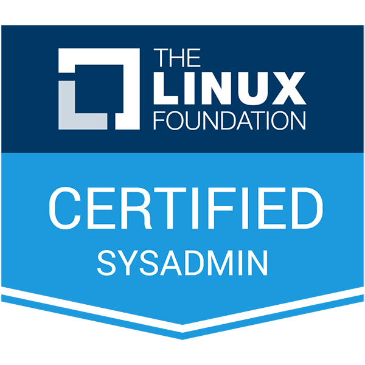

I have had two careers: in Tech, and in Education.

Recently, I decided to steer myself back into Tech. I'd never stopped being interested in computers, systems, open source projects, and programming. So after a decade teaching, I started thinking seriously about working in tech again. Could I regain my youthful excitment? Did I still know anything relevant?

As a refresher, I signed up for a credential exam (on sale!) with The Linux Foundation. The IT / admin world seemed more enthusiastic about Red Hat Enterprise Linux certifications, but I didn't want to box myself in with a specialization. I'm distribution-agnostic, although I keep going back to [Debian](https://www.debian.org) and [derivatives](https://ubuntu.com).

## Hit the Books!

I also grabbed the charming and thorough [Unix and Linux System Administration Handbook](https://www.pearson.com/us/higher-education/program/Nemeth-UNIX-and-Linux-System-Administration-Handbook-5th-Edition/PGM143215.html). I love this book's approach! Practical, yet with that whiff of the magic and humor that makes the Unix ecosystem so wonderful.

The exam itself (without giving away specifics) was structured in an interesting and "real" way. It's a series of mini-projects, with a list of tasks. Can you figure out what to do? Then do it, in a terminal emulator in your browser. Thank you, tmux (reminding me of good ole GNU screen).

In the end, I remembered a great deal that I'd learned on the job--but I also filled in a few important gaps. I'm glad I sat for the exam and got this credential!

